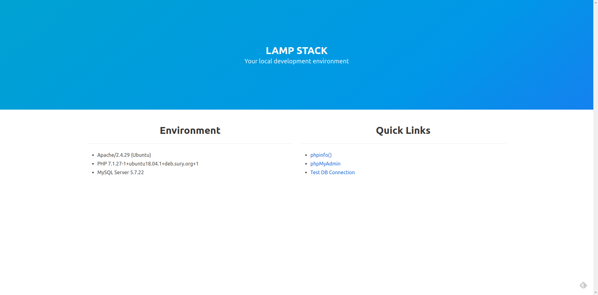

## Installation

Clone this repository on your local computer. Run the `docker-compose up -d`.

```shell
git clone https://github.com/MIR24/docker-compose-lampstack.git
cd docker-compose-lamp/
docker-compose up -d
```

Open http://localhost/.


